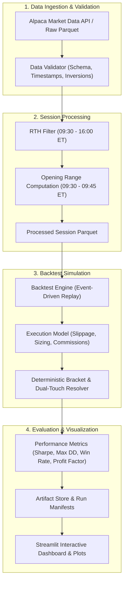

# SPY Opening Range Breakout (ORB) Quantitative Research System

[](https://github.com/acphotinakis/orb/actions/workflows/python-tests.yml)
[](https://github.com/acphotinakis/orb/actions/workflows/gitleaks.yml)
[](https://www.python.org/)
[](LICENSE)

An event-driven quantitative backtesting engine and execution research framework implementing the 15-minute Opening Range Breakout (ORB) strategy on SPY. This repository is designed for historical simulation, execution friction modeling, and strategy research, rather than live automated order execution.

---

## Strategy Assumptions

- **Opening Range (OR):** Evaluates the first 15 minutes of Regular Trading Hours (09:30:00 to 09:45:00 ET). High and low extremes are locked at 09:45:00 ET.
- **Breakout Entry:** Evaluates 1-minute bar closes after 09:45:00 ET. A breakout occurs when a bar close exceeds the OR boundary plus an optional buffer.
- **Exit Brackets:** Fixed target R-multiple take-profit and stop-loss brackets.
- **Conservative Dual-Touch Resolution:** The backtester deterministically resolves modeled intra-bar dual-touch scenarios (where a single bar's high and low touch both Stop Loss and Take Profit) to **Stop Loss first**.
- **Execution Modeling:** Simulates adverse slippage on entries and exits, per-share round-trip commissions, and fixed-dollar risk position sizing.
- **EOD Flattening:** Any open positions are forcefully liquidated at 15:59:00 ET to eliminate overnight exposure.

---

## Quickstart

```bash
# 1. Clone repository
git clone https://github.com/acphotinakis/orb.git
cd orb

# 2. Set up virtual environment (Python 3.10+)
python3 -m venv .venv
source .venv/bin/activate

# 3. Install dependencies
pip install --upgrade pip
pip install -r requirements.txt

# 4. Run test suite (unit + anti-leakage audit + E2E integration)
pytest tests/ -v

# 5. Run backtest pipeline
python -m src.main --config config/default_config.yaml
```

---

## Credential Setup

Historical market data can be fetched from Alpaca Markets. Authentication credentials should be specified in a local `.env` file (which is excluded from Git via `.gitignore`).

Copy the template:
```bash
cp .env.example .env
```

Set the appropriate variables in `.env`:
```text
# Alpaca Paper Trading Credentials (default)
PAPER_APCA_API_KEY_ID=your_paper_api_key_id_here
PAPER_APCA_API_SECRET_KEY=your_paper_api_secret_key_here

# Alpaca Live Trading Credentials (optional)
APCA_API_KEY_ID=your_live_api_key_id_here
APCA_API_SECRET_KEY=your_live_api_secret_key_here
```

To run offline or against cached datasets, the pipeline uses local Parquet data in `data/raw/` and does not require Alpaca credentials.

---

## Architecture Diagram



---

## Testing Methodology

The test suite covers:
- **Unit Tests:** Component isolation for config parsing, time conversions, bar validation, position sizing, bracket calculations, and accounting reconciliation.
- **Anti-Leakage Audit (`tests/anti_leakage/`):** Temporal causality tests that perturb post-OR data and verify that opening range definitions and pre-09:45 state remain strictly invariant.
- **Service & Manifest Integrity:** Verifies checksum-validated run manifests, audit trail permanence, atomic artifact generation, and replay parity.
- **Integration Tests:** End-to-end backtest pipeline runs across synthetic and historical sessions.

---

## Data Source

Historical 1-minute OHLCV bars are retrieved from **Alpaca Markets**:
- **SIP Feed:** Comprehensive national market system feed (requires funded/paid Alpaca account).
- **IEX Feed:** Investors Exchange feed (available on free Alpaca tier).

Data is normalized to UTC timestamps, validated against inverted prices and duplicates, and cached locally as partitioned Parquet files.

---

## Backtesting Limitations

- **Intrabar Ordering:** 1-minute OHLCV bars aggregate all transactions within the minute. Actual price movement sequence within a bar is unknown; adverse dual-touch resolution models the most pessimistic execution path.
- **Fill Assumptions:** Orders are assumed to fill immediately at the trigger or open price plus configured adverse slippage; liquidity constraints and partial fills are not simulated.
- **Market Impact:** Sizing assumes trading volume does not materially affect market price (applicable for liquid ETFs like SPY under standard size).
- **Past Performance:** Historical backtesting results do not guarantee future performance in live market conditions.

---

## Repository Structure

```text
orb/
├── .github/
│   ├── workflows/             # CI workflows (gitleaks, python-tests)
│   └── dependabot.yml         # Dependabot configuration
├── config/
│   └── default_config.yaml    # Config schema & default parameters
├── data/
│   ├── raw/SPY/               # Raw 1-minute historical Parquet cache
│   └── processed/SPY/         # Cleaned RTH session Parquet datasets
├── docs/                      # Architectural specs, runbooks, task logs
├── plots/                     # Output charts (distributions, drawdowns, equity curves)
├── results/backtest/          # Run outputs (trades.csv, metrics.json, manifest.json)
├── src/
│   ├── backtest/              # Event-driven engine, execution model, trace
│   ├── common/                # Config, logging, exceptions, paths, time utils
│   ├── dashboard/             # Interactive Streamlit results explorer & monitor
│   ├── data/                  # Alpaca client, fetcher, validator, processor
│   ├── evaluation/            # Performance metrics & report generation
│   ├── services/              # Artifact store, run service, worker, replay
│   ├── strategy/              # Opening range logic & signal generation
│   ├── visualization/         # Candlestick & performance plotters
│   ├── pipeline.py            # End-to-end orchestration pipeline
│   └── main.py                # Command-line entry point
└── tests/
    ├── anti_leakage/          # Temporal causality verification
    ├── dashboard/             # Dashboard and UI explorer tests
    ├── integration/           # End-to-end pipeline integration tests
    ├── services/              # Run management & manifest verification tests
    └── unit/                  # Modular unit tests
```

---

## Security

Please see [SECURITY.md](SECURITY.md) for vulnerability reporting guidelines and credential handling policies.

---

## Contributing

Contributions, bug reports, and improvements are welcome. Please read [CONTRIBUTING.md](CONTRIBUTING.md) for details on code style, linting, and testing expectations.

---

## License

This project is licensed under the MIT License - see the [LICENSE](LICENSE) file for details.

---

## Disclaimer

This software is for educational and research purposes only. It does not constitute investment advice or a recommendation to buy or sell any financial instrument. Quantitative trading involves substantial risk of loss. Always perform your own research and risk assessment before deploying capital.
