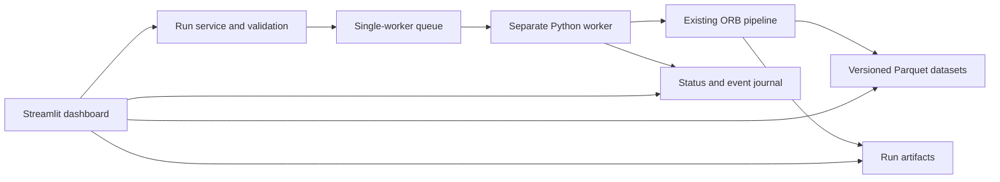

# Interactive live dashboard assessment

Date: September 8, 2026. Repository inspected: `/Users/acphotinakis/dev/orb`, commit `3d6cc28c2c7f2c0ca685f31f9da5d7e0981e711c`.

## Recommendation

Build a local Python dashboard using Streamlit and Plotly, backed by the existing ORB pipeline and a separate worker process. Start with interactive historical research: change validated parameters, launch a run, watch progress, explore trades, replay sessions, and compare experiments. Add streaming market monitoring after the existing configuration and cache issues are corrected.

The repository already supplies most of the calculation layer. It does not currently supply a web application, background job service, structured progress events, or a streaming market-data connection. “Live” should be presented as three distinct modes: running-job progress, historical replay, and current market monitoring. Historical replay must visibly identify itself as replay.

This document is an analysis and proposed implementation, not a completed dashboard. The primary assumption is a local, single-user research tool. Source-code interaction means calling the actual Python engine, tracing results to code, and rerunning after code changes; arbitrary browser-based Python execution is not needed for that workflow.

## Existing code and integration points

| Area | Existing implementation | Dashboard use |
|---|---|---|
| Entry point | `src/main.py`: `parse_args`, `_build_overrides_from_args`, `main` | Keep CLI support, but call a shared service from the dashboard instead of constructing CLI strings. |
| Orchestration | `src/pipeline.py`: `ORBPipeline.run`, `PipelineRunResult` | Main execution boundary; returns metrics, artifact paths, trade count, and elapsed time after completion. |
| Configuration | `src/common/config.py`: frozen dataclasses, `load_config(..., overrides=...)`, `validate_config` | Build validated run configurations from form controls and preserve immutable snapshots. |
| Data | `src/data/fetcher.py`, `alpaca_client.py`, `validator.py`, `processor.py` | Reuse historical downloads, Parquet cache, validation, and session processing. |
| Strategy | `src/strategy/opening_range.py`, `signals.py` | Opening-range calculation and signal representations; reconcile duplicated signal logic before extending it. |
| Simulation | `src/backtest/engine.py`: `BacktestEngine.run` | Produces trades, equity, and daily summaries through sequential session/bar iteration. |
| Evaluation | `src/evaluation/metrics.py`, `reporter.py` | Reuse existing metric formulas and CSV/JSON exports. |
| Storage | `src/common/paths.py`: `PathManager` | Current pipeline writes under `experiments/{experiment_id}/`, with shared data outside that directory. |
| Charts | `src/visualization/` | Existing Matplotlib/mplfinance output is static. Create interactive charts from underlying data. |
| Other strategies | `src/backtest/strategy_backtest.py`, `src/strategies/strat.py` | Separate EMA crossover implementations with their own backtest/reporting contracts. These are not wired into `ORBPipeline`. |
| Verification | `tests/unit/`, `tests/anti_leakage/`, `tests/evaluation/`, `tests/integration/` | Existing regression foundation; see saved test logs and verification notes below. |

The README describes an older output layout and links to `docs/RUNBOOK.md`, while the actual runbook is at repository root. Use the running code and `PathManager` as the integration contract. No existing experiment/data directories were present in the inspected repository root, so the UI needs a useful empty state and synthetic demonstration dataset.

## Fixes required for trustworthy interaction

### 1. Processed cache identity omits settings that change its contents

`PathManager.processed_data_dir` includes symbol, timeframe, and date range, but omits feed, opening-range duration, and force-exit time. `DataProcessor.process` returns the existing Parquet file before rebuilding session flags. Those flags depend on strategy settings.

Changing the opening range from 15 to 30 minutes can therefore reuse flags from the earlier run. Switching feeds can reuse processed data from a different feed. In addition, `ORBPipeline.run(refresh_cache=True)` passes refresh to the raw fetcher but does not pass `force_refresh` to the processor.

Before enabling these controls, key processed data by source dataset identity, feed, timeframe, date bounds, preprocessing version, opening-range duration, and force-exit time. Alternatively, cache only strategy-independent normalized bars and derive strategy flags per run. Propagate explicit refresh through dependent stages. Use atomic writes and serialize writes to shared cache keys.

### 2. Some advertised controls do not affect execution

In `BacktestEngine`, `_check_signal_at_bar` directly checks close prices and uses the opposite range boundary for stops. Although a `SignalGenerator` is constructed, this method implements the engine's entry logic itself. `breakout_confirmation="intrabar"`, `stop_method="atr"`, and the filter settings are not applied by that path.

Do not expose these as functioning controls until implemented and tested. Initially support close confirmation, opposite-range stops, and disabled filters. Consolidate signal decisions behind a shared function used by simulation, explanations, and eventual live monitoring.

### 3. Configuration and run options are separate contracts

The top-level `parameters:` section in `config/default_config.yaml` is not consumed by `load_config`. Dates, refresh, and plot generation are supplied separately to `ORBPipeline.run`. The default YAML specifies `15Min`, while much of the project describes one-minute execution. This affects timing and intra-bar assumptions; it is not merely chart resolution.

Create a validated `RunRequest` containing both the configuration overrides and execution options. Show the effective configuration before submission. Start with a one-minute research preset. Validate symbol consistency between `strategy.ticker` and `data.symbol`, valid clock values, ordered dates, finite numeric inputs, and supported timeframe/window combinations. Existing validation does not comprehensively cover these cases.

The CLI's `--paper` flag is not included in overrides, its advertised `--no-paper` counterpart is absent, and log level is not forwarded into `pipeline.run`. Fix these when unifying CLI and dashboard requests. In the inspected ORB client, paper/live selects credentials for historical data; it does not implement order submission.

### 4. Runs need unique identities and reliable publication

`PathManager` names experiments from run ID, symbol, timeframe, and dates. Reusing the default `baseline_v1` with changed parameters can overwrite results. Generate a UUID per submitted run and store a separate readable label.

Record requested dates/options, effective config, source dataset fingerprint, source-code revision, dirty-worktree status or source hash, creation/completion times, and artifact manifest. The existing config snapshot does not capture every run option. Publish completed artifacts atomically and mark the run complete only after all required outputs are ready.

Processed bars currently live in shared storage and are not returned in `PipelineRunResult.artifacts`. A run should reference an immutable dataset version, so its candlestick chart cannot silently change after another run refreshes shared data.

### 5. Progress and concurrency require a worker boundary

`ORBPipeline.run` is synchronous, and engine state is local to its loops. Its logs describe stages, but no structured progress/cancellation API exists. `setup_logging` clears handlers on a shared logger, making concurrent runs in threads prone to interfering with each other's log destinations.

For the first version, allow one active worker process and queue additional runs. Add optional event and cancellation callbacks to the pipeline/engine. This preserves responsiveness, isolates logging and imports, and allows each new run to load updated source code.

### 6. Static chart generation is currently disabled in the pipeline

The plotting calls in `src/pipeline.py` are commented out, including portfolio and trade charts. Passing `generate_plots=True` does not restore them. The integration test still expects those PNGs. Decide whether to restore the static export contract or intentionally revise it; render dashboard charts directly from tables either way.

### 7. Audit time and end-of-session accounting before streaming

The Alpaca adapter documents timestamps as bar-open times, while the engine uses a bar's close to enter and retains that bar timestamp as entry time. Show bar-start and decision-availability times separately; a completed close cannot be known at bar open.

The engine's fallback end-of-session liquidation occurs after its last equity record. Inspect and test whether final marked equity matches final capital when this fallback is used, including commission effects. Also test missing final bars, coarse timeframes, daylight-saving transitions, and shortened sessions before presenting live session state as authoritative.

## Dashboard behavior

| View | User interaction | Code/data connection |
|---|---|---|
| Run setup | Select symbol, date range, supported strategy/execution parameters; submit once | Validated `RunRequest` → `load_config` → new worker → `ORBPipeline.run` |
| Progress | Follow stage, completed sessions, elapsed time, logs; cancel | Worker status and structured events, polled about once per second |
| Results | Zoom equity/drawdown, filter trades, download artifacts | Existing metrics and run-specific CSV/JSON files |
| Session explorer | Select a day/trade; inspect OHLCV, range, entry, stop, target, exit | Immutable processed bars plus trade ledger |
| Replay | Play, pause, step, change playback speed | Persisted engine events and bars up to the current replay cursor |
| Comparison | Select runs; compare metrics and configuration differences | Run manifest, snapshots, metrics, and aligned equity series |
| Code trace | Inspect rule name, module/function, revision, and decision inputs | Stable source references captured with decision events |
| Market monitor, later | See new bars, range state, signal state, and feed freshness | Separate streaming adapter and incremental strategy state |

Use a submitted form for expensive changes. A slider movement should change a draft configuration; it should not start a download or backtest on every movement. Existing results remain attached to their submitted configuration. Table filtering and chart zooming should not rerun the engine.

A practical first screen has configuration controls on the left, job status across the top, equity/drawdown in the center, and a selectable trade table below. Selecting a trade opens its session chart and decision details. For a robust first implementation, use a table or explicit trade selector; do not assume candlestick clicks expose the same selection events as scatter traces.

## Proposed architecture



Streamlit fragments support timed reruns while a session is active, making them suitable for polling job progress without rerunning the entire interface. The fragment is a display mechanism; it must not own the long-running job. [Streamlit fragment documentation](https://docs.streamlit.io/develop/api-reference/execution-flow/st.fragment).

Plotly supplies OHLC candlestick charts suitable for the session explorer. Add range lines and separate trade-marker traces from existing results, and construct equity/drawdown plots from their underlying series. [Plotly candlestick documentation](https://plotly.com/python/candlestick-charts/).

Keep the initial deployment local. A service interface behind the UI leaves room for a dedicated HTTP API and browser frontend if shared access or more elaborate interaction becomes necessary. Those are additional projects, not prerequisites for the initial dashboard.

### Proposed files

```text
src/dashboard/app.py             UI entry point and navigation
src/dashboard/charts.py          Plotly figure builders
src/dashboard/views/             Setup, progress, results, replay, comparison
src/services/run_service.py      Submit/list/read/cancel operations
src/services/run_models.py       Validated requests, status, manifest schema
src/services/worker.py           Worker process entry point
src/services/events.py           Versioned progress and decision events
src/services/artifact_store.py   Atomic publication and safe artifact lookup
src/data/live_stream.py          Later: streaming adapter
tests/dashboard/                 Service and interaction regression tests
requirements-dashboard.txt      Tested dashboard dependencies
```

These paths are proposals and have not been created by this assessment. Add Streamlit and Plotly to a dedicated dependency file and pin versions after validating them with the existing Python environment. The repository's current requirements are unpinned and do not include these dashboard dependencies.

### Service and event contract

Expose Python methods initially: `submit_run(request) -> run_id`, `get_run(run_id)`, `list_runs()`, `get_events(run_id, after_sequence)`, `get_artifacts(run_id)`, and `cancel_run(run_id)`.

Use states `queued`, `running`, `cancelling`, `cancelled`, `succeeded`, and `failed`. Persist status outside browser session state so reloads do not lose jobs. A small SQLite registry plus per-run files is sufficient for the proposed single-worker design. The supervisor should mark an unexpectedly terminated worker failed or interrupted.

Example proposed event:

```json
{
  "schema_version": 1,
  "run_id": "server-generated-uuid",
  "sequence": 42,
  "event_type": "session_completed",
  "stage": "backtest",
  "session_id": "2025-08-01",
  "completed_sessions": 1,
  "total_sessions": 20,
  "emitted_at": "2026-09-08T16:00:00Z"
}
```

Add `run_started`, `stage_started`, `trade_opened`, `trade_closed`, `run_completed`, and `run_failed` events. Emit coarse progress for normal runs; make detailed per-bar tracing optional to control storage and rendering cost. Record sequence numbers for reconnect/cursor reads. A cancellation request is acknowledged only when the worker reaches a safe boundary; network requests also need bounded timeouts.

Only resolve artifacts through a known run manifest. Generate run IDs internally and validate symbol/path components before passing them to `PathManager`. Keep credentials in the existing server environment and never include them in exported config, browser state, or exception displays. These are direct requirements of exposing filesystem and data-client operations through a UI.

### Illustrative execution adapter

The following uses existing APIs but is only the calculation portion of a future worker. It is not a complete dashboard or a fix for the cache issues above.

```python
from uuid import uuid4
from src.common.config import load_config
from src.pipeline import ORBPipeline

def execute_validated_request(request, repository_root, artifact_root):
    cfg = load_config(
        repository_root / "config/default_config.yaml",
        overrides=request.overrides,
    )
    return ORBPipeline(cfg, base_dir=artifact_root).run(
        start_date=request.start_date,
        end_date=request.end_date,
        refresh_cache=request.refresh_cache,
        generate_plots=False,
        run_id=uuid4().hex,
        log_level=request.log_level,
    )
```

Assign and persist the run ID before worker launch in the complete service; pass that ID to the worker so the registry and pipeline use the same identity. Avoid using shared mutable configs or invoking this function directly inside a polling fragment.

## Historical replay and source-code interaction

For display-only playback, slice completed historical bars/results by a cursor and label future-hidden data consistently. For debugging strategy behavior, capture decisions during the real engine run instead of recomputing a second strategy in UI code. During the opening range, show only the range known at the cursor; do not reveal the final frozen range early.

Each decision trace should include the source rule, bar start and availability times, relevant OHLC values, frozen range, threshold, position state, and accepted/rejected result. Link to the corresponding module/function and recorded revision. A source pane can display allowlisted repository files read-only.

To experiment with source edits, edit the Python files in the usual editor, then launch a new worker. Record a source fingerprint so results distinguish uncommitted changes. Do not hot-swap strategy code inside an active simulation: its behavior must remain tied to its starting revision. A browser source editor, if desired later, needs a separate save/diff/test workflow and explicit scope.

For EMA support, first choose a canonical implementation from the two standalone scripts, then adapt its inputs and outputs behind a strategy interface. Merely adding a strategy dropdown would not make those scripts conform to the ORB pipeline.

## Adding actual live market monitoring

The current `AlpacaDataClient` wraps historical requests. Alpaca's Python SDK separately provides `StockDataStream` and bar subscriptions, which can support a new streaming adapter. [Alpaca real-time stock data API](https://alpaca.markets/sdks/python/api_reference/data/stock/live.html).

Run the stream in a persistent service, independent of browser reruns. Store incoming bars and expose bounded snapshots to the dashboard. Track subscription/feed identity, last event time, connection state, and stale data. Implement reconnection, gap backfill, deduplication, and corrected-bar handling; verify feed access against the configured account rather than assuming availability.

Extract incremental strategy state with operations such as `on_bar`, `snapshot`, and `end_session`, then use the same decision functions for historical replay and live monitoring. The current batch processor prunes incomplete opening-range sessions, so repeatedly passing an unfinished session through the whole pipeline is not a suitable live-state engine.

Define exactly when a bar is final, how its availability timestamp is calculated, and what happens to already-published signals after corrected data arrives. Test identical finalized bars through historical and streaming paths for consistent decisions. Current monitoring can display simulated signals; broker order placement would require a separate execution and reconciliation subsystem, which is absent from the inspected ORB path.

## Implementation sequence and acceptance criteria

| Phase | Deliverable | Acceptance criterion |
|---|---|---|
| 1. Correctness foundation | Cache identity/refresh fixes, supported config contract, unique run manifests, clarified chart contract | Changing OR duration/feed cannot reuse incompatible processed data; identical inputs are reproducible; existing failures are understood and corrected. |
| 2. Results explorer | Streamlit app, synthetic demo, experiment selector, Plotly charts, trade table/downloads | Runs can be explored without credentials or network access; displayed metrics match exported results. |
| 3. Run control | Validated forms, single worker, status/events, cancellation, errors | UI stays responsive; duplicate submission is prevented; refreshing the browser retains the job; failed runs are not shown as completed. |
| 4. Replay and comparison | Decision tracing, cursor playback, run diffs, code references | Future data stays hidden during replay; code/config/data provenance accompanies every comparison. |
| 5. Streaming monitor | Stream adapter and incremental strategy state | Disconnect/reconnect and gap recovery are tested; freshness is visible; historical/live finalized-bar decisions agree. |

Estimate effort only after reproducing and scoping the baseline test failures. The batch results explorer is a much smaller change than incremental market monitoring; a single schedule for both would conceal the main uncertainty.

Tests should cover cache invalidation, symbol/date/type validation, exactly-once submission, cancellation/error states, artifact publication, no-trade results, timezone serialization, final-equity reconciliation, replay causality, and configuration effects. Keep calculations in Python; do not duplicate metric formulas in the dashboard. Normalize non-finite metrics to explicit unavailable values when crossing strict JSON boundaries, and preserve metric units.

## Verification performed

Inspected the repository structure, configuration, CLI, pipeline, data/cache processing, engine, reporter, logging, strategy entry points, and relevant tests. Existing source files were not modified. Secrets in `.env` were not read. No live market request or order was intentionally executed.

The first selected test run stopped at collection because `tests/unit/test_metrics.py` and `tests/evaluation/test_metrics.py` collide under the default import mode. Full output is in [test-results.txt](test-results.txt).

A second run uses `--import-mode=importlib` to bypass that collection collision, with output saved separately in [test-results-importlib.txt](test-results-importlib.txt). The selected scope is unit tests, anti-leakage tests, evaluation tests, and the synthetic pipeline integration test. The CLI integration test was excluded because it invokes the historical-data path and may access the network; its acceptance of either exit code 0 or 1 also does not demonstrate a successful pipeline.

Exact second command:

```sh
MPLCONFIGDIR=/private/tmp/orb-dashboard-mpl .orb_venv/bin/python -m pytest --import-mode=importlib -o pythonpath=. tests/unit tests/anti_leakage tests/evaluation tests/integration/test_pipeline_e2e.py::test_pipeline_e2e_execution -q > docs/dashboard-analysis/test-results-importlib.txt 2>&1
```

See [verification-summary.md](verification-summary.md) for the final result and limitations. External framework capabilities were checked against the official documentation linked above; the architectural choices and effort boundaries are recommendations based on this repository.
